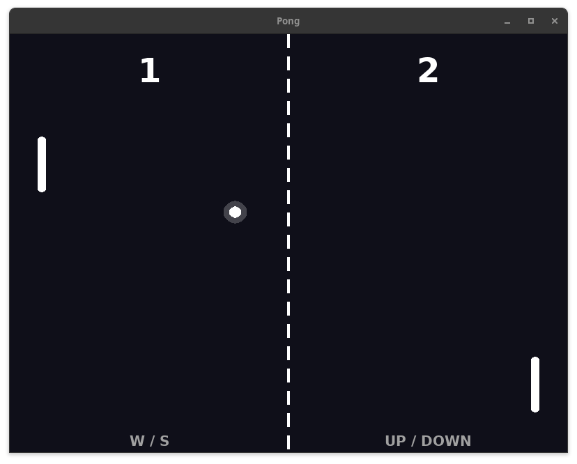
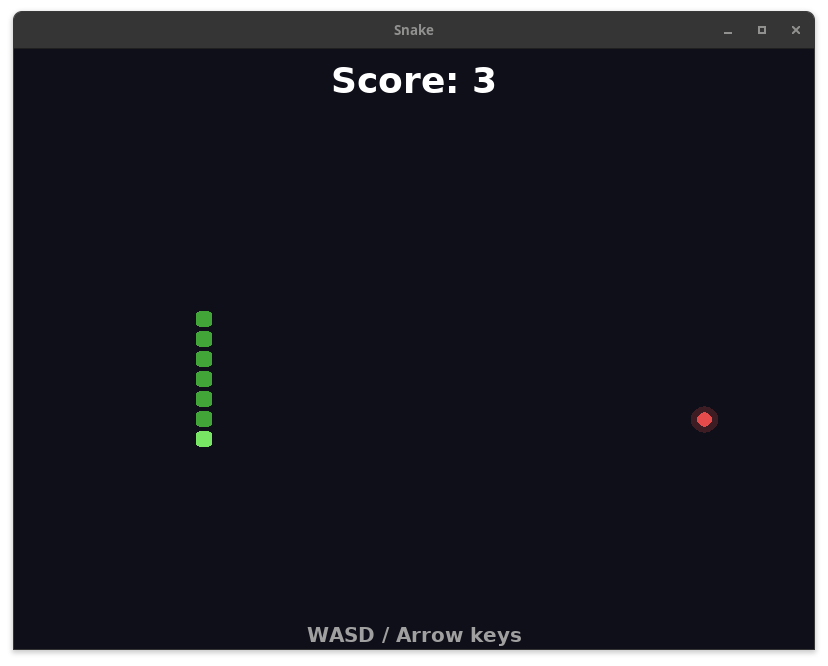
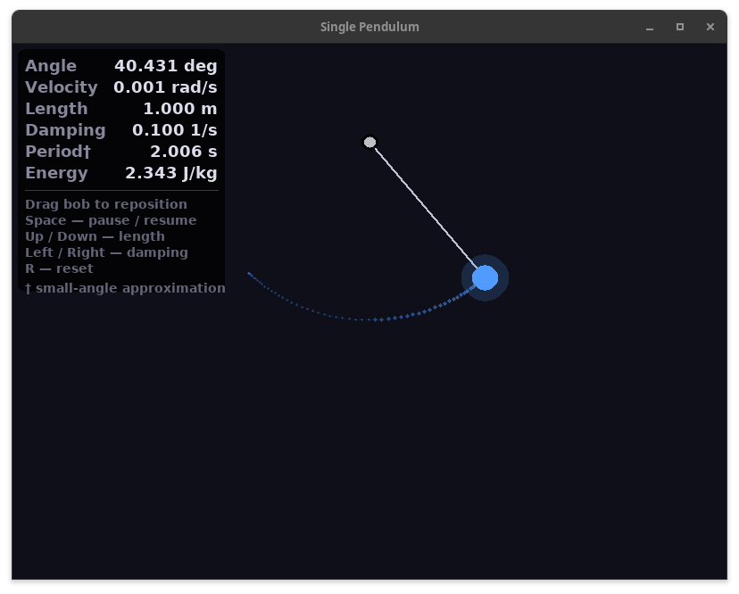

# Cinder

A minimal, beginner-friendly 2D graphics library for C.

[](https://github.com/UniquePython/cinder/releases)
[](https://github.com/UniquePython/cinder/actions/workflows/ci.yml)
[](LICENSE)
[](README.md)
[](CMakeLists.txt)
[](https://www.libsdl.org/)
[](https://uniquepython.github.io/cinder)

## What is Cinder

SDL2 is a powerful foundation, but it asks you to manage renderers, surfaces, and event queues before you can draw a circle. Cinder sits on top of SDL2 and collapses that setup into a single header and a straightforward game loop, so a beginner can focus on building something instead of configuring something. It is not a game engine — there are no scenes, no entities, no editor — just a clean API for a window, input, and drawing.

## Getting Started

A Cinder program looks like this:

```c
#include <cinder/cinder.h>

int main(void)
{
    if (CinderInit(CINDER_SUBSYSTEM_ALL) != CINDER_STATUS_OK)
        return 1;

    if (CinderCreateWindow(CinderDefaultWindowDesc()) != CINDER_STATUS_OK)
        return 1;

    while (CinderIsRunning())
    {
        CinderBeginFrame();

        CinderClearBackground(CINDER_BLACK);

        CinderEndFrame();
    }

    CinderQuit(); // cleans up window, renderer, and SDL
    return 0;
}
```

## Building & Installation

> Tested on Linux and macOS. Windows support is experimental —
> MSVC has stricter C compliance requirements that may require source changes.

### Dependencies

Install the required libraries before building.

```bash
# Ubuntu/Debian
sudo apt install libsdl2-dev libsdl2-image-dev libsdl2-gfx-dev libsdl2-ttf-dev libsdl2-mixer-dev

# Arch
sudo pacman -S sdl2 sdl2_image sdl2_gfx sdl2_ttf sdl2_mixer
```

### Building Cinder

```bash
git clone https://github.com/UniquePython/cinder.git
cd cinder
cmake -B build
cmake --build build -j$(nproc)
sudo cmake --install build
```

### Using Cinder in Your Project

**CMake:**
```cmake
find_package(Cinder REQUIRED)
target_link_libraries(your_target PRIVATE Cinder::Cinder)
```

**Makefile / manual:**
```makefile
CFLAGS  += $(shell pkg-config --cflags cinder)
LIBS    += $(shell pkg-config --libs cinder)
```

**Raw gcc:**
```bash
gcc main.c $(pkg-config --cflags --libs cinder) -o myapp
```

Then include the header:

```c
#include <cinder/cinder.h>
```

## API Overview

| Module | Header | Description |
|---|---|---|
| Subsystem | `cinder/cinder_subsystem.h` | Initialize and shut down Cinder subsystems |
| Window | `cinder/cinder_window.h` | Create and destroy the application window |
| Loop | `cinder/cinder_loop.h` | Game loop control — begin frame, end frame, quit |
| Input | `cinder/cinder_input.h` | Keyboard and mouse state, per-frame and held queries |
| Drawing | `cinder/cinder_draw.h` | Lines, circles, triangles, rectangles |
| Textures | `cinder/cinder_texture.h` | Load, draw, and destroy image textures |
| Audio | `cinder/cinder_audio.h` | Load and play sound effects and music |
| Blend Modes | `cinder/cinder_blend.h` | Set blend modes globally or per-texture — none, alpha, additive, multiply |
| Text & Fonts | `cinder/cinder_text.h` | Load fonts, draw text, cache rendered text |
| Timers | `cinder/cinder_timer.h` | Delta time, FPS, and general-purpose timers |
| RNG | `cinder/cinder_rng.h` | PCG32 random number generator — integers, floats, directions, and a global convenience API |
| Math & Types | `cinder/cinder_math.h` | Vectors, points, sizes, rectangles, circles and math operations. Linkable without SDL as `Cinder::Math` |
| Plugins | `cinder/cinder_plugin.h` | Register and manage lifecycle plugins with init, update, draw, and shutdown callbacks |
| Error & Logging | `cinder/cinder_error.h` | Error state, log callbacks, and the `CINDER_LOG` macro |

## Examples

The `examples/` directory contains Pong, Snake and Pendulum built with Cinder.

<figure align="center">
  
  <figcaption><em>Figure 1: Pong game in Cinder</em></figcaption>
</figure>

<figure align="center">
  
  <figcaption><em>Figure 2: Snake game in Cinder</em></figcaption>
</figure>

<figure align="center">
  
  <figcaption><em>Figure 3: Single Pendulum simulation in Cinder</em></figcaption>
</figure>

## License

Cinder is licensed under the [MIT License](LICENSE).